# Changelog

## v2.17.0 — F17 Slice 1: real PDF rendering via WeasyPrint

### Added
- **WeasyPrint-based PDF renderer** — new `backend/services/pdf_renderer.py` exposes `render_pdf(layout_name, context) -> bytes` using Jinja2-rendered HTML+CSS. Layouts live on disk under `backend/templates/reports/` (currently `default.html`).
- **`default.html` layout** — styled report covering both `vulnerabilities` (CVE/title/severity/CVSS/status/assignee/published table) and `dashboard_summary` (KPI tiles + by-severity / by-status tables). Uses CSS paged media for page numbers (`@bottom-center: counter(page) of counter(pages)`) and per-row page-break protection.

### Changed
- **`/api/reports/{vulnerabilities,dashboard}/export?format=pdf`** now returns a real PDF rendered by WeasyPrint instead of the previous hand-written 5-object PDF stream. Same payload, same artifact contract, real fonts and page breaks. Sync request path is unchanged for this slice — async/Celery move is Slice 2.
- **`Dockerfile`** installs WeasyPrint native deps (`libpango-1.0-0`, `libpangoft2-1.0-0`, `libcairo2`, `libgdk-pixbuf-2.0-0`, `libffi8`, `shared-mime-info`, `fonts-dejavu-core`). Adds ~80–120 MB to the backend image; cold-start renders are ~300 ms.
- **`requirements.txt`** pins `WeasyPrint>=63,<66` and `Jinja2>=3.1,<4`.

### Tests
- New `backend/tests/services/test_pdf_renderer.py` — unit tests confirm both layouts produce valid `%PDF-` bytes including the empty-rows path.
- Existing `test_reports_export_contract.py` (5 tests) continues to pass against the new renderer; full suite green (295 passed).

## v2.16.0 — F15 Phase 2: team admin UI + active-team plumbing

### Added
- **Teams admin route** (`/admin/teams`, Admin-only) — list / create / rename / delete teams and manage memberships. Added sidebar link and `frontend/src/views/admin/adminTeamsView.js`, backed by the existing `/api/teams` and `/api/me/teams` endpoints.
- **Top-nav team selector** — shown for users in ≥2 teams (and always for Admins), persists the active team in `localStorage` and re-navigates the current route on change so data reloads under the new scope.
- **`X-UVT-Team-Id` header** — `apiFetch` reads `session.currentTeamId` from the store and attaches it on every request. CORS already permits the header (`backend/uvt_app.py:32`); backend resolves it in `backend/auth.py:_populate_current_team`.
- **Session state** — `state.session.teams` and `state.session.currentTeamId` are now part of the persisted session. New `setCurrentTeam()` and `setSessionTeams()` actions on the store.
- **`GET /api/auth/me` returns `teams` + `current_team_id`** — saves a second round-trip from the frontend on login/refresh.
- **Team surfaced in UI** — product create form gains a team picker (for admins and multi-team users); product list cards show the owning team; vulnerability detail shows "Team" (or "Shared (global)" for team_id IS NULL).

### Serializer changes
- `product_json` now includes `team_id` and `team_name`.
- Vulnerability detail payload (`backend/api/vuln_crud.py` get_vulnerability) includes `team_id` and `team_name`. Added missing `Vulnerability.team` relationship.

### Fixed
- **Products page rendered "No products found" with a populated catalog** — `productsView.js` treated the paginated `/api/products` response (`{items, page, ...}`) as a flat array. Now unwraps `.items` before rendering.

### Screenshots (after)

| Page | Screenshot |
|------|-----------|
| Login |  |
| Dashboard | 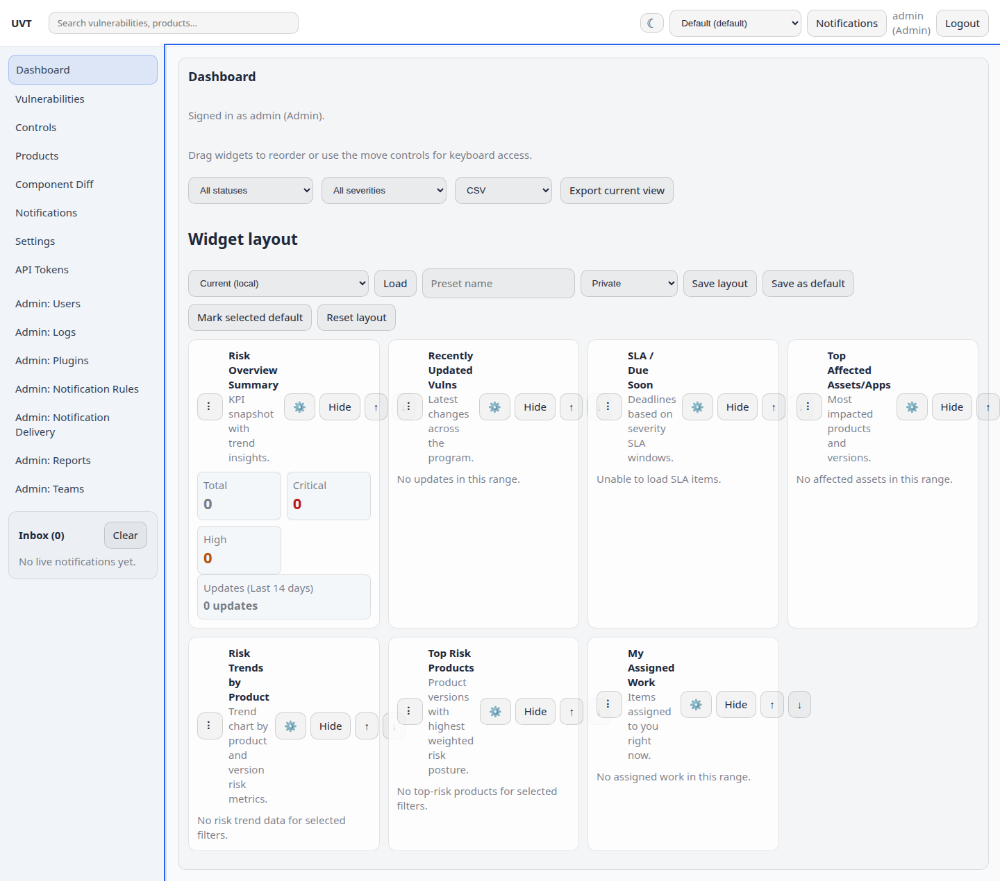 |
| Vulnerabilities | 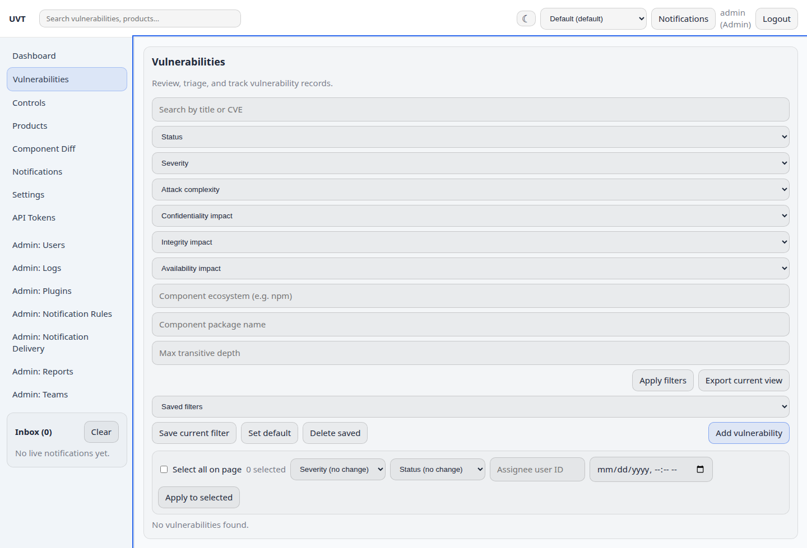 |
| Products (with team chip) | 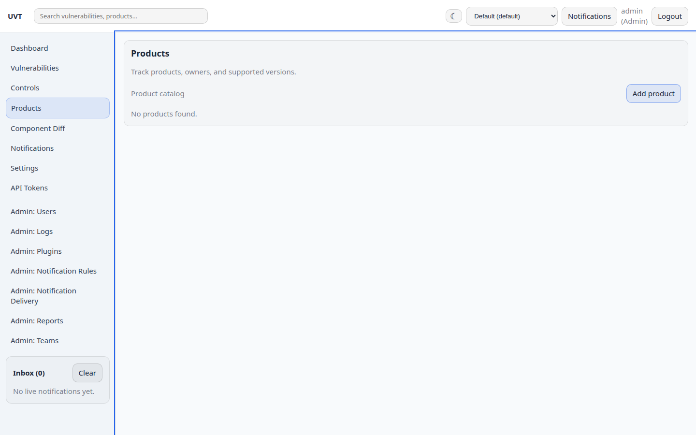 |
| Admin: Users (header team selector) | 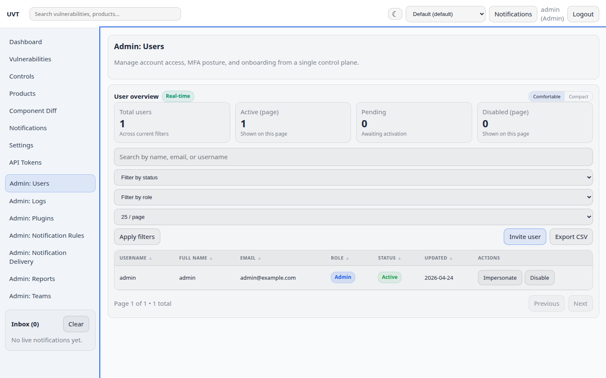 |
| Admin: Teams (new) | 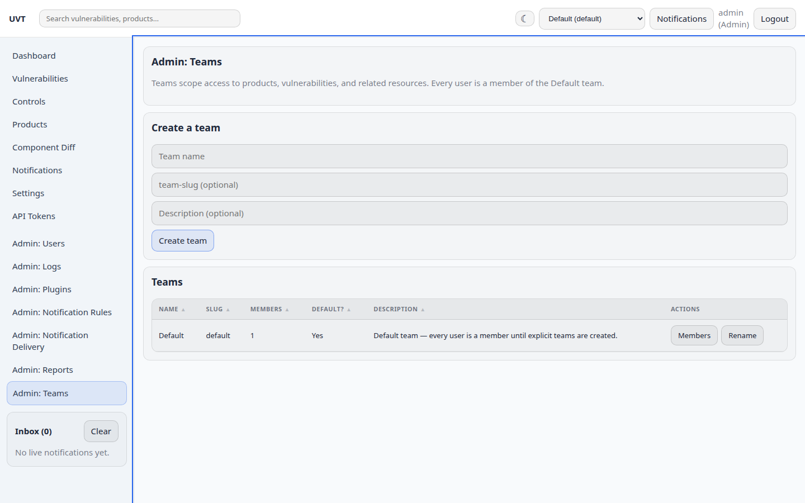 |

## v2.12.0

### Added
- **Visual review screenshot tool** — `scripts/screenshot-pages.py` captures all 13 frontend pages via Playwright for automated visual inspection. Supports `--save-as` to persist before/after snapshots in `docs/images/` for changelog records. Added `requirements-dev.txt` (playwright) and documented workflow in CLAUDE.md.

### Fixed
- **Auth cookies not sent in Docker/compose** — Frontend `API_BASE` defaulted to `http://127.0.0.1:5000` (cross-origin), causing the browser to reject cookies set by a different origin. Changed default to `""` so requests go same-origin through the nginx proxy. Also added `AUTH_COOKIE_SECURE=false` to docker-compose.yml since the default compose setup uses HTTP.
- **Nginx 502 with nerdctl** — `nginx.conf` used `resolver 127.0.0.11` (Docker-specific embedded DNS). Removed the explicit resolver so nginx resolves via the container's `/etc/resolv.conf`, which works with both Docker and nerdctl.
- **Vulnerabilities page blank** — `refreshSavedFilters()` assigned the full paginated response object (`{items:[], page:1, ...}`) to an array variable, then called `.forEach()` on it, crashing the view. Fixed to unwrap `.items` from the paginated response.
- **Sidebar visible on login page** — Showed "Please log in." text in the sidebar on public pages. Now hides the sidebar entirely when not authenticated, and the main content area spans the full width.

### Screenshots (after fixes)

| Page | Screenshot |
|------|-----------|
| Login | 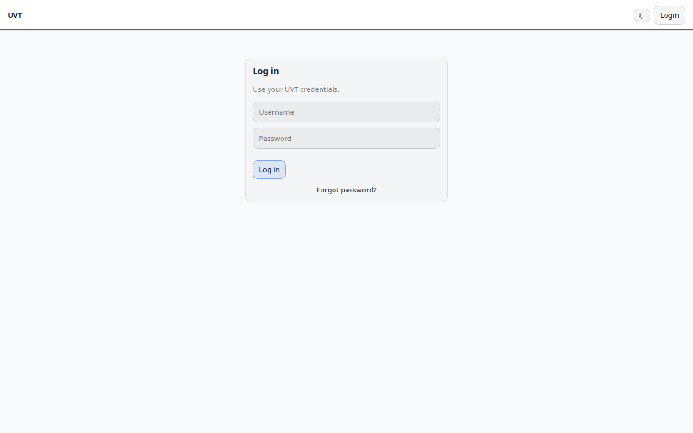 |
| Dashboard | 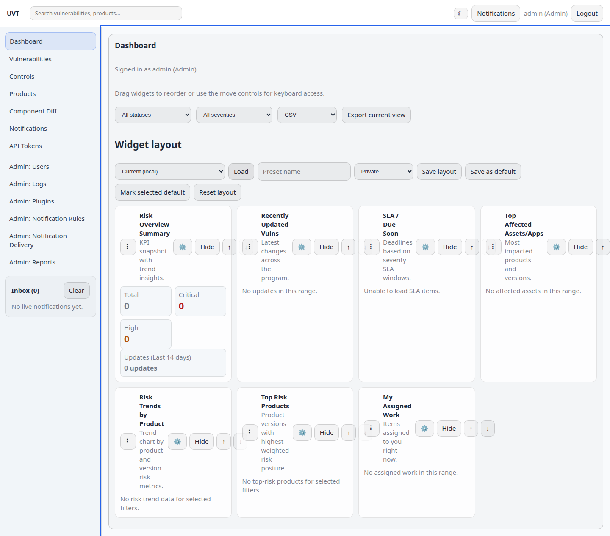 |
| Vulnerabilities | 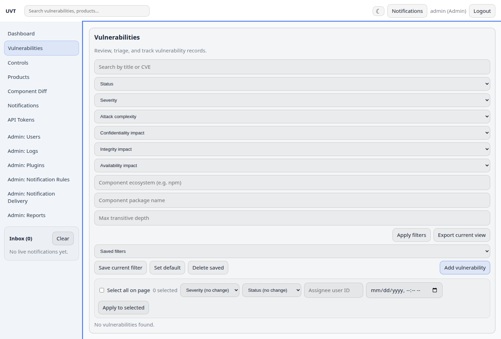 |
| Products | 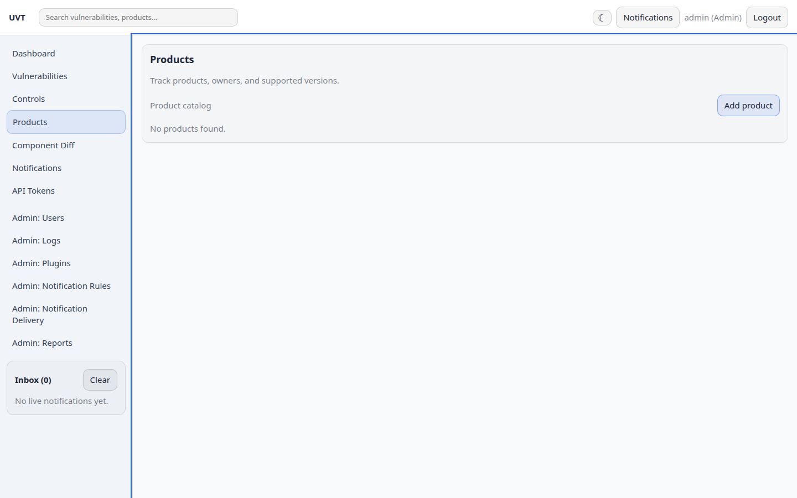 |
| Controls | 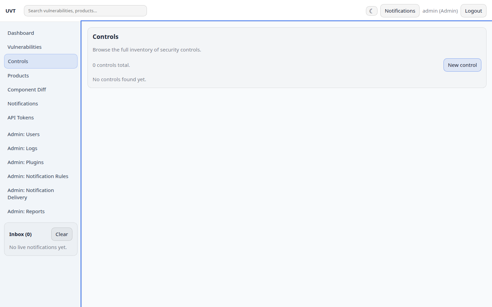 |
| Admin: Users | 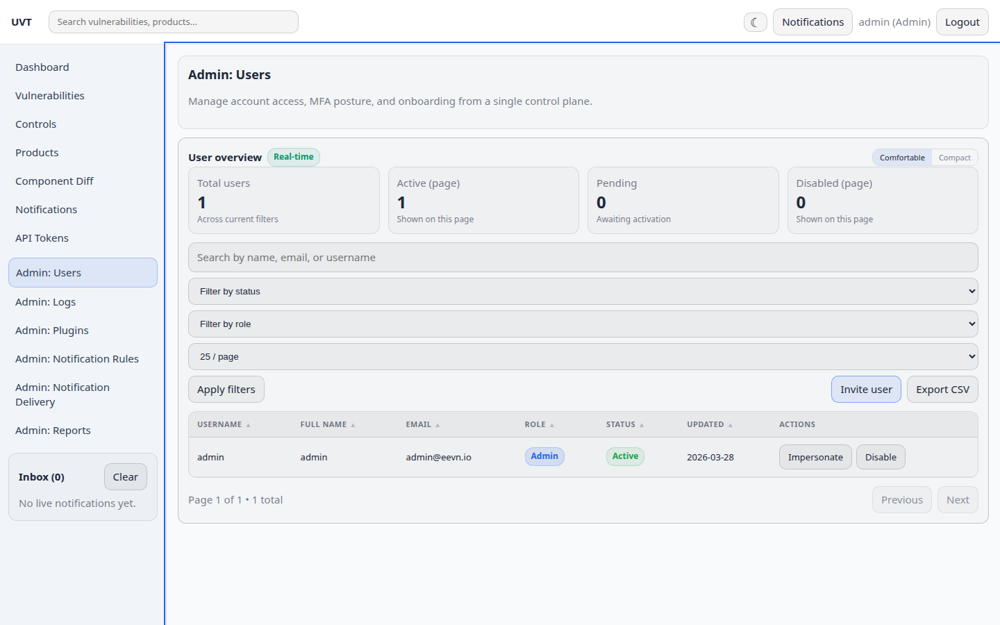 |

## v2.3.4

### Added
- **V5: Loading & empty states** — Added `loadingBlock()`, `skeletonRows()`, and `emptyState()` helper functions in `frontend/src/ui/components/loading.js`. CSS includes `@keyframes spin` spinner, `@keyframes shimmer` skeleton animation, and `.empty-state` centered message with icon. Ready for drop-in use across all async views.

## v2.3.3

### Added
- **V4: Consistent spacing system** — Replaced hardcoded pixel spacing with CSS custom property references (`var(--spacing-sm)`, `var(--spacing-md)`, etc.) across all four stylesheets. Added layout utility classes (`.flex-col-*`, `.flex-row-*`, `.gap-*`, `.mt-*`, `.mb-*`, `.p-*`) and form field wrappers (`.form-field`, `.form-field-sm`) for consistent spacing throughout the frontend.

## v2.3.2

### Added
- **V3: Responsive / mobile layout** — Rewrote `layout.css` with three responsive breakpoints (≤1024px collapsed sidebar, ≤768px hidden sidebar with hamburger toggle, ≤480px stacked widget grids). Added `.sidebar-toggle` hamburger button in header, sidebar overlay with `.open` class for mobile, and responsive grid adjustments for dashboard widgets.

## v2.3.1

### Changed
- **V1: Extract inline styles from JS to CSS** — Extracted ~170 inline `style:` attributes from 24+ JS view files into reusable CSS classes. Added widget component classes (`.widget-surface`, `.widget-card`, `.widget-row`, `.widget-kpi-grid`, `.widget-grid`), widget table grids, modal classes (`.modal-backdrop`, `.modal-panel`, `.modal-sm/md/lg`), max-width utilities, badge/divider patterns, and notification dropdown styles. Remaining ~60 inline styles are truly dynamic (computed values, display toggles).

## v2.2.4

### Security
- **S7: Add `pip-audit` to CI** — New `dependency-audit` job in `repo-hygiene.yml` runs `pip-audit` on every push and PR to detect known vulnerabilities in Python dependencies.

## v2.2.3

### Added
- **F11: Database connection pool tuning** — Added `DB_POOL_SIZE` (default: 5), `DB_POOL_MAX_OVERFLOW` (default: 10), `DB_POOL_RECYCLE` (default: 1800s), and `DB_POOL_PRE_PING` (default: true) env vars. Pool settings apply to PostgreSQL deployments; SQLite is unaffected. `pool_pre_ping` is enabled by default to handle stale connections.

## v2.2.2

### Added
- **F5: Structured JSON logging with request ID correlation** — Replaced `logging.basicConfig()` with structured JSON formatter (`python-json-logger`). Each request gets a unique ID (from `X-Request-ID` header or auto-generated), injected into all log records and returned in `X-Request-ID` response header. Access log records method, path, status, duration, and user ID. Configurable via `LOG_LEVEL` (default: `INFO`) and `LOG_FORMAT` (`json` or `text`) env vars.

## v2.2.1

### Security
- **S2: Remove temp password from API response** — `POST /api/users/invite` no longer returns the plaintext password. Instead, a time-limited password-reset email is sent to the invited user.

### Added
- **F2: Self-service password reset** — New `POST /api/auth/forgot-password` and `POST /api/auth/reset-password` endpoints with single-use, 60-minute tokens (SHA-256 hashed in DB). Frontend forgot-password and reset-password pages linked from login. Rate-limited with `RATE_LIMIT_SENSITIVE_LIMIT`. New `PasswordResetToken` model, `FRONTEND_URL` config var, and 9 backend tests.

## v2.1.4

### Added
- **V8+V9: Badge/pill CSS system + typography scale** — Added CSS classes for severity badges (`.badge-critical`, `.badge-high`, etc.), status pills (`.pill-open`, `.pill-resolved`, etc.), SLA badges, and typography utilities (`.text-xs` through `.text-2xl`). Colors match existing inline JS styles, ready for V1 extraction in Phase 4.

## v2.1.3

### Added
- **V7: Hover & interactive states** — Added `transition` smoothing (0.15s) and `:hover` effects to `.btn`, `.card`, `.nav a`, and `.input` elements for a more responsive UI feel.

## v2.1.2

### Added
- **V2: CSS custom properties (design tokens)** — Defined `:root` design tokens in `base.css` covering colors, severity palette, spacing, radii, and typography scale. Migrated all four CSS files (`base.css`, `layout.css`, `components.css`, `pages.css`) from hardcoded values to `var()` references. No visual change — enables future theming and consistency.

## v2.1.1

### Security
- **S4/F10: Security response headers** — Added `after_request` hook in `uvt_app.py` setting `X-Content-Type-Options: nosniff`, `X-Frame-Options: DENY`, `Referrer-Policy: strict-origin-when-cross-origin`, and `Content-Security-Policy: default-src 'none'; frame-ancestors 'none'` on all responses. `Strict-Transport-Security` (2-year max-age, includeSubDomains) is added only when `auth_cookie_secure` is enabled (production).

## v2.0.7

### Changed
- **F1: Remove Alembic/Flask-Migrate references** — Removed `flask_migrate` and `alembic` from fallback pip install in `setup-dev.sh` and `setup-dev.ps1`. Replaced migration init/upgrade commands with direct `db.create_all()` via the app factory. Fixed duplicate env var block in PowerShell script.

## v2.0.6

### Security
- **S9: Rate-limit health endpoint** — `/api/health` now rate-limited at 120 requests/60s via configurable `RATE_LIMIT_HEALTH_LIMIT` / `RATE_LIMIT_HEALTH_WINDOW_SECONDS` env vars, preventing abuse as an unauthenticated DoS vector.

## v2.0.5

### Security
- **S8: Fix account enumeration timing** — `authenticate_user()` now runs `verify_password()` against a dummy hash when the user is not found or inactive, ensuring constant-time response regardless of username validity.

## v2.0.4

### Security
- **S6: Password complexity validation** — Added `validate_password()` with 12-character minimum to `auth.py`. Enforced in `create_user()`, admin user creation, invite, and password reset endpoints. Auto-generated invite passwords now use `token_urlsafe(16)` to meet the minimum. All test fixtures updated to use compliant passwords.

## v2.0.3

### Security
- **S5: Log CSRF validation failures** — CSRF check in `auth.py` now logs a warning with method, path, remote address, and whether cookie/header were present, aiding detection of potential attack attempts.

## v2.0.2

### Security
- **S3: Tighten rate limits on user creation/invite** — `create_user` and `invite_user` endpoints now use `RATE_LIMIT_SENSITIVE_LIMIT` (10/60s) instead of the generic write limit (30/60s), reducing bulk-creation risk from compromised admin accounts.

## v2.0.1

### Security
- **S1: Fix hardcoded debug mode** — `app.run(debug=True)` in `uvt_app.py` now gates on `FLASK_ENV=development` instead of being unconditionally enabled. Prevents Werkzeug interactive debugger and stack trace exposure in production.

## Unreleased

### Security
- **Secret key validation** — App now raises `RuntimeError` on startup if `SECRET_KEY` or `JWT_SECRET` still hold dev defaults outside of development/testing environments (`backend/uvt_app.py`)
- **Input validation hardening** — Replaced bare `int()` casts on user input with `parse_int()` in notification rule create/update endpoints, returning proper 400 errors instead of 500s
- **Security audit** — Created `SECURITY_FIXES.md` with 9 findings: critical debug=True in entry point, temp password exposure in API response, lenient rate limits on user creation, missing security headers, and more

### Added
- **CI test jobs** — Added `backend-tests` (Python 3.12, pytest with coverage) and `frontend-tests` (Node 20) jobs to `.github/workflows/repo-hygiene.yml`
- **Pagination** — Created shared `paginate_query()` helper in `backend/api/validation.py` with `?page=` and `?per_page=` query params (default 50, max 200); applied to notification rules, products, active users, saved filters, report templates, and report schedules
- **Database indexes** — Added indexes on `Vulnerability.status`, `Vulnerability.created_by`, `Vulnerability.assigned_to`, `AuditLog.user_id`, and a composite index on `SoftwareComponent(product_version_id, name)`
- **Docker support** — Multi-stage `Dockerfile` (Python 3.12-slim backend + nginx:alpine frontend), `docker-compose.yml` with backend/frontend/postgres/redis services, `docker/nginx.conf` for API proxying, and `.dockerignore`
- **Typed configuration** — Created `AppConfig` frozen dataclass in `backend/config.py`, replacing 45+ scattered `os.getenv()` calls with validated, typed config loaded at startup (B9)
- **Service layer extraction** — New `backend/services/product_service.py` and `backend/services/attack_vector_service.py` encapsulating business logic previously embedded in route handlers (B6)
- **Component correlation tests** — 12 tests for `services/component_correlation.py` covering PURL, CPE, SBOM CVE matching, dedup, and dependency path extraction (0% → 100% coverage)
- **OIDC mapping tests** — 16 tests for `services/oidc_mapping.py` covering role mapping, claim parsing, edge cases (78% → 100% coverage)
- **SBOM ingest tests** — 18 tests for `services/sbom_ingest.py` covering CycloneDX/SPDX parsing, component upsert, dependency graph, vulnerability mapping (59% → 96% coverage)
- **Backend architecture wiki** — `docs/BACKEND.md` documenting all modules, models, services, auth, plugins, rate limiting
- **Frontend architecture wiki** — `docs/FRONTEND.md` documenting all 18 pages/routes, state management, API adapters, UI primitives
- **Feature roadmap** — `FEATURE_ROADMAP.md` with 20 features across P0/P1/P2 priorities for production readiness
- **Visual rework plan** — `VISUAL_REWORK.md` with 10 improvements: CSS tokens, inline style extraction, responsive layout, loading states, data tables
- **PostgreSQL optional install** — New `requirements-postgres.txt` for PostgreSQL-only dependency; setup scripts auto-install when `DATABASE_URL` is postgres

### Fixed
- **N+1 query in SBOM ingest** — `correlate_vulnerability_to_components()` now accepts a `product_version_id` filter; `sbom_ingest.py` uses `yield_per(100)` for streaming instead of `.all()`
- **Exception logging** — Added `logger.exception()` to generic catch blocks in `auth_routes.py`, `vulnerabilities.py`, `products.py`, and the 500 error handler; narrowed `except Exception` to `except (TypeError, ValueError, OSError)` in `auth.py` token validation
- **Frontend stale caches** — Added 5-minute TTL to `cachedProductVersions`, `cachedAttackVectors`, and `cachedTerminalImpacts` in `vulnListView.js`
- **Frontend state bug** — `upsertNotification()` in `store.js` now calls `emit()` so subscribers are notified of changes
- **Deprecated datetime usage** — Replaced all `datetime.utcnow()` with timezone-aware `datetime.now(timezone.utc)` across 25+ backend files; added `TZDateTime` type decorator to ensure naive SQLite datetimes are tagged UTC on read (B3)
- **Reports API smoke test** — Fixed `reportsApi.test.js` to assert cookie-based auth (`credentials: "include"`) instead of nonexistent Bearer token `Authorization` header

### Changed
- **Centralized audit logging** — Extracted `record_audit()` convenience wrapper into `backend/services/audit.py`, replacing duplicated `_audit()` helpers across 5 API modules
- **Centralized serializers** — Moved inline serialization helpers into `backend/serializers/`: `product_serializers.py` (`product_json`, `version_json`), `control_serializers.py` (`control_json`), `notification_rule_serializers.py` (`rule_json`)
- **Route splitting** — Split three oversized API modules into focused blueprints (B4):
  - `vulnerabilities.py` (1017 lines) → `vuln_crud.py`, `vuln_comments.py`, `vuln_versions.py`, `vuln_bulk.py`
  - `reports.py` (855 lines) → `report_exports.py`, `report_templates.py`, `report_schedules.py`
  - `users.py` (499 lines) → `users_crud.py`, `users_tokens.py`, `audit_logs.py`
- **Error standardization** — Replaced all 63 inline `jsonify({"error": ...})` returns with `error_response()` helper across 7 API files (B5)
- **Frontend view splitting** — Split three oversized frontend view files into focused modules (F1):
  - `dashboardView.js` → `dashboardConstants.js`, `dashboardWidgets.js`, `dashboardView.js`
  - `vulnListView.js` → `vulnShared.js`, `vulnVersions.js`, `vulnAttackVectors.js`, `vulnTerminalImpacts.js`, `vulnCard.js`, `vulnListView.js`
  - `productsView.js` → `productCard.js`, `productsView.js`
- **API client splitting** — Extracted `ApiError` class and token refresh logic from `client.js` into `errors.js` and `authRetry.js` (F2)
- **Docker hardening** — Pinned base image digest, added non-root user, added healthcheck to Dockerfile (C3)
- **Docker externalized secrets** — Removed inline credentials from `docker-compose.yml`, using env vars with defaults (C2)
- **psycopg made optional** — Removed `psycopg[binary]` from `requirements.txt` (not needed for SQLite dev); Dockerfile and setup scripts updated to install from `requirements-postgres.txt` when PostgreSQL is in use (D1)
- **README rewritten** — Updated with capabilities overview, full configuration tables, project layout tree, CLI commands, and links to all documentation
- **Documentation reorganized** — Moved `BACKEND.md`, `FRONTEND.md`, `CHANGELOG.md`, `TESTING_README.md` into `docs/` directory
