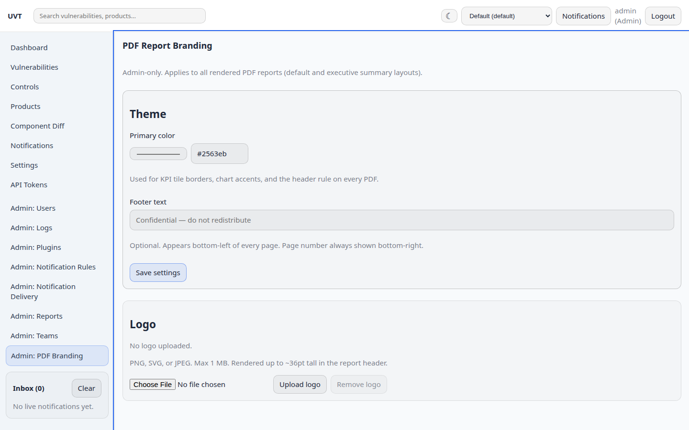
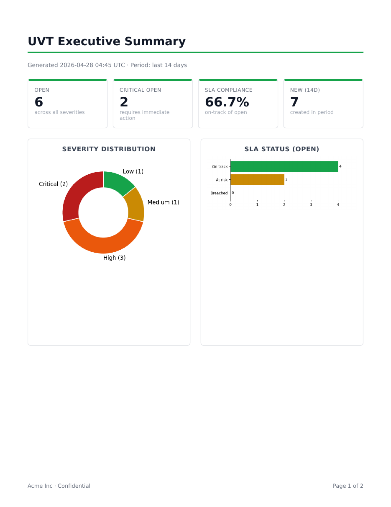
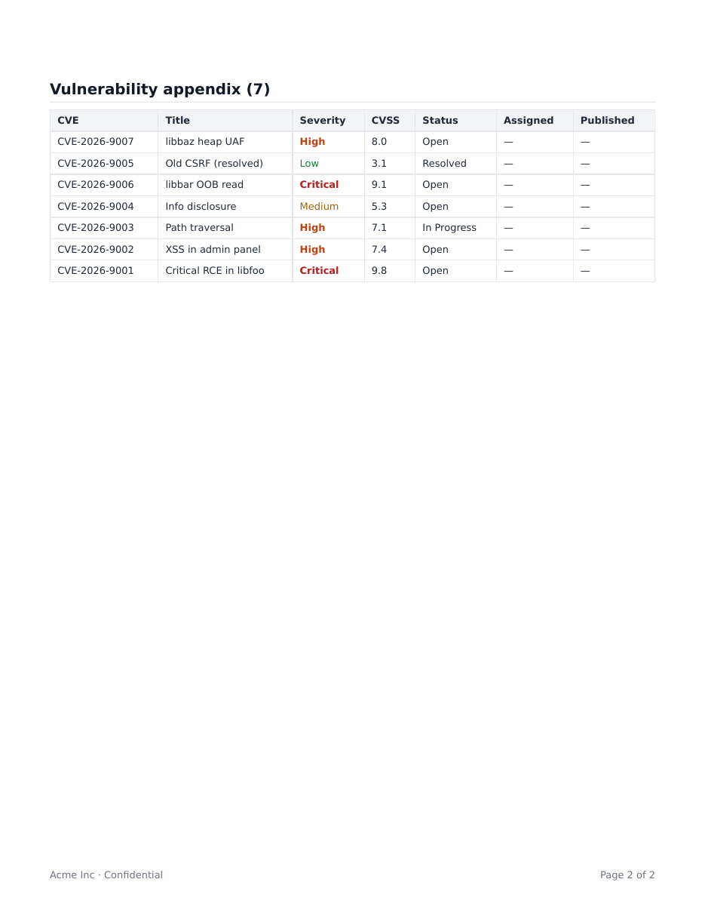
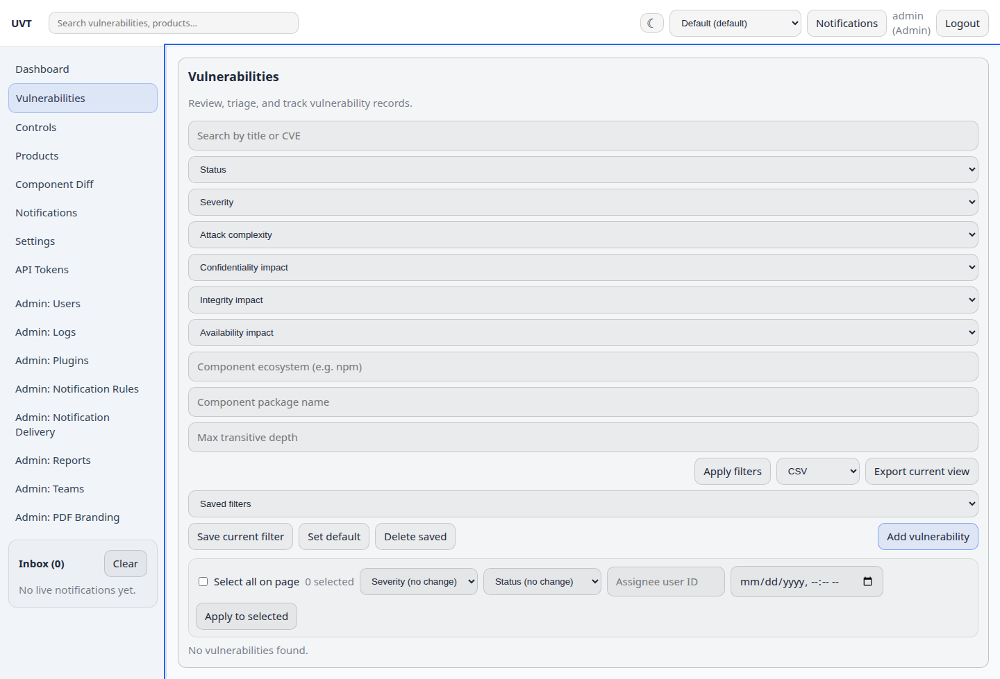

# Changelog

## v2.24.0 — Adversarial review remediation

An adversarial review of v2.23.0 (security, missing functionality, visual
design, usability) found 22 issues, all reproduced against the shipped Docker
stack. This release fixes them.

### Blockers

- **Database migrations reinstated.** F1 had removed Alembic in favour of
  `db.create_all()`, which creates missing *tables* but never adds a column to
  an existing one. v2.23.0's four new columns therefore never appeared on
  upgraded databases, and `/api/vulnerabilities`, `/api/dashboard/summary`,
  `/api/search` and `/api/webhooks` all returned 500 while `/api/health` still
  reported `ok`. Flask-Migrate is back with a squashed `0001` baseline;
  `backend/schema_guard.py` refuses to serve and names the reason when the
  database is behind head; `backend/tests/test_migrations.py` fails the build
  if a model changes without a revision.
- **`scripts/update-db.sh` no longer destroys the database.** It ran
  `flask db upgrade` — a command that did not exist — and treated the failure
  as a failed migration, taking a `pg_restore --clean --if-exists` branch
  against the live database. The documented upgrade path always failed and
  always clean-restored while migrating nothing. It now stops on failure and
  tells the operator where the backup is.
- **SSE no longer exhausts the worker pool.** Gunicorn ran 4 *sync* workers
  while the frontend opens an EventSource per session, so four open tabs took
  the whole service offline. Switched to `gthread` (4 x 25) with a per-user
  stream cap and a maximum stream lifetime; the frontend reconnects with
  backoff instead of silently giving up on the first drop.

### Security

- **API token scopes are enforced across the whole API.** They were checked
  only for paths matching a ten-entry prefix list; a `products:read` token
  could read the audit log and create teams and webhook endpoints. `ROUTE_SCOPES`
  is explicit and closed, unmapped routes fail closed, and `audit_route_scopes()`
  names any unmapped endpoint at boot.
- **Security headers moved to the HTML document.** They were set by Flask,
  which serves only `/api/*`, so the strict CSP landed on JSON while the page
  that executes the app had none — and was fully framable.
- **`seed-admin` enforces the password policy.** It called `hash_password()`
  directly, so the documented `--password changeme` created an Admin the API
  itself would have rejected.
- **Per-account lockout, and login throttling keyed on (IP, username).** The
  IP-only key meant one user's typos throttled everyone behind the same NAT
  gateway, while a distributed attack on one account was unthrottled.
- `AUTH_COOKIE_SECURE` now defaults to true in the shipped compose file.
- Request bodies are bounded (`MAX_CONTENT_LENGTH`, nginx `client_max_body_size`)
  — previously unbounded, and nginx's 1 MB default silently broke scanner imports.
- SSRF guard resolves hostnames and refuses redirects; the syntactic check
  alone was walked past by any DNS record pointing at link-local space.
- Webhook secrets are no longer stored in plaintext, and ingest requires a
  signed timestamp (bounded replay window).
- The SSE endpoint no longer accepts a JWT in the query string.
- CSRF protection extended to `logout`, `logout_all` and the MFA routes.
- `/metrics` accepts an optional `METRICS_TOKEN`; the backend port is no longer
  published by the compose file.

### Functionality

- **MFA (TOTP)** with two-phase enrolment, hashed single-use recovery codes,
  and a signed short-lived login challenge. The Admin → Users page had claimed
  to manage "MFA posture" while no second factor existed anywhere.
- **EPSS** enrichment from FIRST.org, alongside the existing KEV flag.
- **Risk acceptance** with a mandatory expiry, approver and reason, plus an
  expiring-acceptances endpoint. It was previously a bare status string.
- **Evidence attachments** on findings, with an extension allowlist, size cap
  and content hash.
- **Severity/CVSS agreement checking** — the API accepted `Critical` with
  `CVSS 5.5` and rendered both without comment.
- Analysts and Viewers can manage their own API tokens and look up assignees;
  both were behind an Admin-only scope, which also left the bulk-assign field
  asking for a user ID they could not discover.
- The SLA widget works: `ensureActiveUsers()` returned the `{items: []}`
  envelope where callers expected an array, and cached failures forever.
- The dashboard states each widget's scope, and the KPI tile no longer labels a
  status-filtered count "Total". `range` is validated instead of silently
  falling back to 14 days.

### Background jobs — the whole pipeline was dead in Docker

Found by asking whether the plugins actually work. With `CELERY_ENABLED=true`
(the compose default) **every** background task was silently dropped, so plugin
runs, async PDF rendering, notification scans and the retention purge all hung
forever with their rows stuck in "running"/"pending". Four separate causes:

- The worker ran `celery -A backend.celery_app:celery worker`, which imports
  only the module defining the Celery instance. `backend.tasks` was never
  imported in the worker process, so its registry was empty and every message
  was answered with "Received unregistered task ... ignored and discarded".
  Fixed with `include=["backend.tasks"]`.
- The worker never called `create_app()`, so `ContextTask` was never installed
  and any task that got that far died on its first database access with
  "Working outside of application context". Added `backend/celery_worker.py`
  as the entrypoint, and pointed compose at it.
- `celery-beat` ran with **no schedule at all** — the container was a no-op
  despite the UI exposing per-plugin schedules. Added a beat schedule and a
  `uvt.run_due_plugins` task that honours each plugin's own interval.
- Plugin config values were never coerced to their declared types. An HTML
  form yields strings, so `timeout_seconds` was stored as `"30"` and the KEV
  feed died on `urlopen(timeout="30")`. `prepare_plugin_config` now coerces on
  read and write, so configs already stored wrong repair themselves.

Also: artifact-persistence failures were replaced wholesale with the string
"artifact persistence failed", discarding the real exception and logging
nothing. The cause is now logged and included in the message — that opacity is
what hid the timeout bug.

Verified end to end: the CISA KEV plugin fetches the live catalog (1,660
entries) and correctly flags CVE-2021-44228 with its real KEV date.

### Infrastructure

- nginx re-resolves the backend per request (`resolver` + a variable in
  `proxy_pass`). It cached the upstream IP at config load, so any backend
  restart or rebuild left the whole app returning 502 until nginx was
  restarted too — permanent downtime from a transient backend crash.
- celery-worker, celery-beat and frontend now have healthchecks that reflect
  their actual state. The celery services inherited the backend's HTTP
  healthcheck and reported unhealthy forever; nginx listened IPv4-only while
  `localhost` is `::1` in-container.

### Design and usability

- Vulnerabilities page: compact filter bar with the seven advanced filters
  behind a disclosure, result count, and the primary action in the page header.
  Page height 4,371px → 3,721px, with results above the fold.
- Result rows use a real column grid; the four "Not Defined" cells are gone and
  CVSS is padded to one decimal. EPSS and CWE columns added.
- Dashboard widget headers give the title its own row instead of sharing it
  with five bordered buttons in a 276px card.
- **Zero WCAG AA contrast failures** in both themes (was 31); role and status
  badges were the worst offenders at 2.55:1.
- **Zero unlabeled form controls** (was 45); skip link and `h1` on every route;
  targets meet the 24px minimum.
- Header no longer overflows the viewport on a phone.

## v2.23.0 — v2.22 deferred security follow-ups + CISA KEV, watcher notifications, remediation metrics

Lands the five items deferred from the v2.22.0 analysis pass plus five new features. Plan in `PLANNED_IMPROVEMENTS.md`.

### Security (the v2.22.0 deferred list)
- **Webhook ingest HMAC verified against the raw secret** — the server previously keyed the HMAC with the stored SHA-256 *hash* of the secret, a value external senders never receive (the tests were signing with a value read out of the DB), so real integrations could never produce a valid signature; and since the stored hash *was* the verification key, hashing provided no at-rest protection either. New/rotated endpoints now store the secret (`WebhookEndpoint.secret`, SQLite backfill) and verify raw-secret HMACs; pre-v2.23.0 endpoints keep legacy hash-keyed verification until rotated — rotation upgrades them (`api/webhooks.py`, `models/webhooks.py`).
- **SSRF guard on outbound notification deliveries** — new `services/url_guard.py` validates Slack webhook, Jira base, and generic notification-webhook URLs: http/https only, and loopback/private/link-local/reserved IP literals plus local hostnames (`localhost`, `*.local`, `*.internal`, dotless) are refused. Syntactic-only (no DNS), so it is deterministic and worker-safe. Opt out for intranet targets with **`OUTBOUND_ALLOW_PRIVATE_URLS=true`**.
- **Plugin `file_path` confinement** — feed/controls plugins read admin-supplied filesystem paths; with **`PLUGIN_DATA_DIR`** set, `file_path` must resolve inside it (`resolve_plugin_file_path` in `plugins/base.py`). Empty default preserves existing behavior, matching the F3/F15 opt-in gating posture.
- **Short-lived, marked impersonation tokens** — impersonation minted a normal 12-hour JWT indistinguishable from a login token. It now expires after **`IMPERSONATION_TOKEN_MINUTES`** (default 15) and carries `impersonation: true` + `impersonated_by: <admin id>` claims; the response includes `expires_in_minutes` (`api/users_crud.py`, `auth.generate_token` gained `expires_in`/`extra_claims`).
- **Password policy beyond bare length** — passwords containing the username or the email local-part, and a small worst-passwords denylist, are rejected (`auth.validate_password`, applied at register/create/invite/admin-reset/token-reset).

### Added
- **CISA KEV integration (`vuln-feed-kev` plugin)** — maps the Known Exploited Vulnerabilities catalog; new `Vulnerability.known_exploited` + `kev_date_added` columns (SQLite backfill), exposed in list/detail JSON, filterable via `?known_exploited=true`, and badged (dark-red "KEV") in the vulnerability list card and detail views. Defaults to *annotation mode* (`only_flag_existing: true`) so a catalog sync flags tracked CVEs instead of importing ~1000 unrelated rows.
- **Watched-vulnerability notifications** — the `notify_on_watched_vuln_update` preference existed end-to-end but nothing ever fired. Watchers now get in-app notifications (+ live `watched_vulnerability_updated` events) on update/status/assignment events, excluding the actor and opted-out users (`notify_watchers_for_event` in `services/notification_rules.py`).
- **Audit-log CSV export** — `GET /api/audit-logs/export.csv` (Admin-only, rate-limited, honors the `action`/`table` filters, capped at 10 000 rows) plus an **Export CSV** button on Admin → Logs.
- **Remediation metrics** — new `Vulnerability.resolved_at` stamped on the transition into Resolved/Closed and cleared on reopen (single-update, bulk-update, and create paths); `GET /api/reports/remediation-metrics?range=...` returns MTTR (avg/median days, by severity) and open-age buckets (0-7/8-30/31-90/90+), team-scoped.
- **Global search covers software components** — name/ecosystem/purl matching with product-team scoping; the header search dropdown gained a Components group linking to the owning product (`api/search.py`, `ui/layout/header.js`).

### Changed
- **Feed ingest stops discarding CVSS vector / CWE / references** — `NormalizedVuln` gained `cvss_vector`, `cvss_version`, `cwe_id`, `references` (deduped merge into `references_json`), and the NVD mapper extracts them (metrics accepted at payload level and under `cve` for the NVD 2.0 shape).
- **All native `window.confirm` / `window.prompt` dialogs replaced** with the in-app modal (new `confirmModal()` beside `promptModal()`: theme-aware, focus-trapped, Escape/backdrop cancel, `alertdialog` semantics, destructive styling) — 17 call sites across teams, tokens, delivery, branding, products, versions, saved filters, mappings, merge, and delete flows.
- **Webhook ingest honors `RATE_LIMIT_TRUSTED_PROXIES`** — the ingest rate-limit key and delivery-log `client_ip` now use the trusted-proxy-aware resolver (new public `rate_limiter.get_client_ip()`) instead of raw `remote_addr`.
- Removed the dead `backend/middleware.py.txt` stub file.

### Tests
- Backend: suite grows 341 → **377** (+36): rewritten `test_webhooks.py` signs like a real external client (+ legacy-fallback and hash-rejection cases) and new `backend/tests/test_v2_23_features.py` (34 tests) covers the URL guard, path confinement, impersonation claims/lifetime, password policy, NVD mapper fidelity, KEV mapper/plugin/filter, watcher notifications (incl. opt-out and actor exclusion), audit CSV export, `resolved_at` lifecycle + metrics endpoint, and component search. 357 passed locally; the 20 PDF-rendering tests could not run in the dev environment (Pillow/WeasyPrint C extensions built for Python 3.13 vs. the system's 3.14 — venv needs a rebuild) and are untouched by this pass.
- Frontend: 28 passed (unchanged).

## v2.22.0 — Systematic analysis pass: PostgreSQL bug fixes, security & accessibility

A repo-wide analysis (multi-agent code review + automated full-app screenshot review against the Docker/PostgreSQL stack) surfaced a set of correctness, security, performance, and accessibility issues. The most impactful were **PostgreSQL-only bugs that the SQLite test suite could not catch** — they were found by exercising the running app.

### Fixed
- **Component filter crashed on PostgreSQL (500)** — filtering vulnerabilities by component (ecosystem/name/depth) did `join(...).distinct()`, and `SELECT DISTINCT` over the `json` columns (`references_json`, `merge_metadata_json`) has no equality operator on PostgreSQL. This broke the entire "vulnerabilities by component" section of **every product detail page** and any component filter. Replaced with an `IN (subquery)` semi-join (`services/vulnerability_query.py`), which is portable and also avoids duplicate rows.
- **Global search was dead (404)** — the blueprint had `url_prefix="/api"` *and* a `@bp.get("/api/search")` route, so it resolved at `/api/api/search` while the frontend called `/api/search`. The header search box never worked. Fixed the route (`api/search.py`).
- **Dashboard summary & risk-trends crashed (500) for "Month to date" / "Quarter to date"** — `range_start()` returned naive datetimes that were then compared against timezone-aware `updated_at`, raising `TypeError`. `range_start()` and `parse_iso_datetime()` now always return aware UTC (`services/reporting_service.py`).
- **Scheduled notifications dropped on transient failures** — the scan advanced the dedup checkpoint even when delivery failed, so a single Slack/Jira/webhook/email error suppressed all retries for the whole frequency window. The checkpoint now only advances on success (`services/notification_rules.py`).
- **SLA state showed "breached" for Resolved/Closed vulns** — `compute_sla_state()` now returns a new `met` state for resolved/closed items, so they aren't counted in the dashboard breach widget or shown as breached (`services/sla.py`, with frontend badge/palette + CSS support).
- **Vulnerability detail rendering** — removed a stray literal `"null"` (native `append()` coerces `null` ternaries to a text node); the SLA state now renders as a badge instead of the raw enum; and **Assigned to / Created by show the username** instead of the raw user id (new `assignee_username` / `creator_username` response fields).
- **Default saved filter silently failed to apply** — the component controls were omitted from `applyFilterValues`, throwing a swallowed `TypeError` (`features/vulnerabilities/view/vulnListView.js`).
- **Team switcher didn't reload data** — `navigate(samePath)` is a no-op (no `hashchange`); it now calls the router directly (`ui/layout/header.js`).
- **Malformed live-notification timestamps** — `sent_at` was `"…+00:00Z"` (double designator); normalized to a single `Z` (`live_notifications.py`).
- **Unescaped LIKE wildcards in global search** — a query of `_` or `%` matched everything; user input is now escaped (`api/search.py`, shared `escape_like` helper).
- **Celery beat crash-looped in Docker** — the container runs as the non-root `app` user, but `celery beat` tried to write its `celerybeat-schedule` state file into the root-owned `/app` workdir (`[Errno 13] Permission denied`), so the beat service never stayed up. It now writes to `/tmp/celerybeat-schedule` (`docker-compose.yml`).

### Security
- **Rate limiter no longer trusts spoofable `X-Forwarded-For`** — it took the leftmost (client-controlled) IP, so an attacker could rotate the header to dodge login/auth throttles. It now trusts only the rightmost N proxy-appended hops, configurable via the new **`RATE_LIMIT_TRUSTED_PROXIES`** (default `1`; set `0` when running without a reverse proxy). (`rate_limiter.py`, `config.py`)
- **Cross-team product-version linking blocked** — attaching versions to a vulnerability now verifies team access per version (non-admins can't link or probe another team's versions), and a non-existent id no longer 500s on the FK (`api/vuln_versions.py`).
- **Last-admin lockout prevented** — demoting or deactivating the final active administrator (via `update_user` or `toggle-active`, including self) now returns `409` instead of locking everyone out of admin functions (`api/users_crud.py`).

### Performance
- **Removed N+1 queries** — the vulnerability list eager-loads `affected_components` (`api/vuln_crud.py`) and the audit-log list eager-loads its related user (`api/audit_logs.py`).
- **Added an index on `Vulnerability.severity`**, a primary filter and sort field (`models/vulnerabilities.py`).

### Accessibility & UX
- **Login is now a real `<form>`** with associated `<label>`s — Enter submits and the inputs are announced (placeholders aren't labels).
- **Modal dialogs trap focus** within the dialog and restore focus to the trigger on close (`ui/components/modal.js`).
- **Sortable table headers are keyboard-operable** (Enter/Space) and expose `aria-sort` + `scope` (`ui/components/dataTable.js`).
- **Animations honor `prefers-reduced-motion`** (`assets/styles/components.css`).
- **Fixed two listener/timer leaks** — the dashboard risk-overview widget leaked a 30s `setInterval` poll and a store subscription on every render (now self-clean when detached); the global-search outside-click `document` listener was re-added on every header render (now bound once) (`features/dashboard/view/dashboardWidgets.js`, `ui/layout/header.js`).

### Changed
- Removed dead validation helpers (`optional_string`, `FieldSchema`, `schema_field`, `validate_schema`) and added a shared `escape_like` (`api/validation.py`).
- `CLAUDE.md` brought current: route-module count (26 → 32), model bounded-context list, services list (added `team_scope`, data retention, scanner imports, webhook ingest), and the `flask purge-old-data` CLI command.

### Tests
- Backend: **341 passed** (was 331). New `backend/tests/test_v2_22_fixes.py` (9 tests: LIKE escaping, tz-aware ranges, SLA `met` state, live-notification timestamp, component filter incl. de-duplication, global-search route + wildcard escaping, last-admin guard both ways, and scheduled-scan retry-after-failure) plus a cross-team version-link test in `test_team_isolation.py`.
- Frontend: 28 passed (unchanged).

### Notes / deferred
The analysis also flagged lower-priority items intentionally left for follow-up to keep this pass reviewable: broader replacement of native `window.confirm`/`prompt` with the in-app modal, an SSRF allowlist for notification webhook/Slack/Jira URLs, plugin `file_path` restriction, webhook HMAC secret-vs-hash verification, and scoped/short-lived impersonation tokens.

## v2.21.0 — F3: email verification on registration

Closes the last open roadmap item. Previously descoped, F3 is now implemented by re-using the existing F2 password-reset machinery and the `email_delivery` service — no new external dependency.

### Added
- **`REQUIRE_EMAIL_VERIFICATION` config flag** (default `false`). Behavior is identical to before until an operator opts in, matching how F15/F17 were gated. Documented in `backend/dev.env` and `docs/DEPLOYMENT.md`.
- **`User.email_verified` column** (default `True`). Existing users, admin-invited users, OIDC logins, and the seeded admin are all treated as verified. SQLite dev DBs auto-backfill via `_SQLITE_USER_COLUMN_BACKFILL` (`DEFAULT 1`), so upgrading never locks anyone out.
- **`EmailVerificationToken` model** + **`services/email_verification.py`** — `create/validate/consume_verification_token` and `send_verification_email`, mirroring `password_reset.py`. Tokens are SHA-256 hashed at rest, 24-hour expiry, single-use, and previous outstanding tokens are invalidated on reissue.
- **`POST /api/auth/verify-email`** `{token}` — confirms the address, flips `email_verified`, and writes a `VERIFY_EMAIL` audit record.
- **`POST /api/auth/resend-verification`** `{email}` — always returns `200` (anti-enumeration); issues a fresh token only for an existing, active, still-unverified account.
- **`email_verified` exposed** in `serialize_user` so admins can see verification status.

### Changed
- **`POST /api/auth/register`** — when `REQUIRE_EMAIL_VERIFICATION` is on, a public registration creates an unverified user, sends the verification email, and returns `201` with `{email_verification_required: true}` **without** auto-login tokens. The bootstrap Admin (first user on a fresh install) is always exempt so an operator can't lock themselves out before mail is configured. When the flag is off, registration is unchanged (auto-verified + auto-login).
- **`POST /api/auth/login`** — blocks unverified users with `403` when the flag is on.

### Tests
- Backend: 331 passed (was 319). New `backend/tests/api/test_email_verification.py` (12 tests) covers the flag-off default, unverified registration, first-user exemption, login gating, the verify/resend endpoints, single-use + expiry + reissue invalidation, and anti-enumeration responses.

## v2.20.0 — F17 follow-ups: trend chart, top components, async cleanup, worker recycle

### Added
- **Activity trend line** on the executive-summary PDF — Matplotlib line chart of vulnerabilities updated per day across the report period, computed from `executive_summary()`'s new `trend_buckets` field.
- **Top affected components panel** on the executive-summary PDF — table of up to 10 components (name + ecosystem + open vuln count) sorted by open count, computed from `top_affected_components(vulns, limit)` operating on already-loaded vuln objects (no extra query, works in both sync and Celery paths).
- **`CELERY_WORKER_MAX_TASKS_PER_CHILD`** config (default `100`) — applied via `celery.conf.worker_max_tasks_per_child`. Recycles each worker child after N tasks to release WeasyPrint + Matplotlib memory held across PDF renders. Documented in `docs/DEPLOYMENT.md`.
- **Cookie-only artifact download test** — confirms the SPA's raw `fetch(... credentials: include)` works against `/api/reports/artifacts/<id>/download` without an `Authorization` header (the signed token in the URL still binds artifact to user).

### Changed
- **`generate_report_task` simplified** — dropped the legacy `report_type/export_format/filters/user_id/pdf_layout` kwargs branch and the unused `_build_export_artifact_async()` helper. The task now takes only `artifact_id` and finalizes a pre-created pending artifact (the only mode actually called since v2.18.0).
- **`init_celery()` — ContextTask reads the active Flask app from `celery._uvt_flask_app` at call time** instead of capturing it via closure. Eliminates a stale-binding hazard exposed by the test suite (per-test apps would otherwise route into the first app's app_context and miss its in-memory SQLite DB). Single-app prod deployments behave identically.

### Tests
- Backend: 319 passed (was 314).
  - `test_pdf_charts.py` adds 2 tests (`trend_line` data URI / empty-input behavior).
  - `test_pdf_renderer.py` adds 1 test for the top-components panel.
  - `test_reports_async_pdf.py` adds 1 lifecycle test for `dashboard_summary` async PDF (mirroring the vulnerabilities one).
  - `test_reports_export_contract.py` adds 1 cookie-auth download test.
- Frontend: 28 passed (unchanged).

## v2.19.0 — F17 Slice 3: PDF report branding (logo + color + footer)

### Visual review (v2.19.0-after)

| Page | Screenshot |
|------|-----------|
| Admin: PDF Branding (new) |  |
| PDF — exec summary, page 1 (charts) |  |
| PDF — exec summary, page 2 (appendix) |  |
| Vulnerabilities (export controls now visible) |  |

### Added
- **`OrganizationBranding` model** (`backend/models/branding.py`) — singleton row holding `primary_color`, `footer_text`, and `logo_path`. Logo bytes live on disk under `instance/branding/`; the model exposes a `logo_data_uri()` helper that the renderer embeds inline so WeasyPrint never needs filesystem access from the template.
- **Admin branding API** (`backend/api/branding.py`, `/api/admin/branding`) — `GET` for everyone, `PUT` (color + footer) and `POST/DELETE /logo` for Admins only. Uploads are validated: PNG / SVG / JPEG, ≤ 1 MiB, content-type and extension checked.
- **Admin: PDF Branding view** (`/admin/branding`) — color picker (hex + native input), footer text field, logo upload/remove with status indicator. Linked from the sidebar.
- **Branding injected into PDFs** — both `default.html` and `executive_summary.html` already consume `branding.primary_color` (CSS variable for KPI tile borders, header rule, accents), `branding.footer_text` (rendered in `@bottom-left`), and `branding.logo_data_uri` (rendered in the header). Renderer auto-loads the row when no explicit branding context is passed.

### Tests
- New `backend/tests/api/test_branding.py` (8 tests) — defaults, admin-only `PUT`, color/footer validation, logo upload/delete lifecycle, oversize and bad-extension rejection, end-to-end injection into a rendered exec-summary PDF.
- Full suite green (314 backend + 28 frontend).

## v2.18.0 — F17 Slice 2: charts, executive summary, async PDF rendering

### Added
- **`backend/services/pdf_charts.py`** — Matplotlib (Agg backend) chart helpers returning base64 PNG data URIs: `severity_donut(by_severity)` and `sla_bar(sla_status)`. Both gracefully return `None` when there's no data.
- **`executive_summary.html` layout** — 4 KPI tiles (Open / Critical open / SLA compliance % / New in period), severity donut + SLA bar side-by-side, page-break-isolated vulnerability appendix table. Selected via `?pdf_layout=executive_summary` on the export endpoints; the default layout (`pdf_layout=default`) is unchanged.
- **`executive_summary()` aggregator** in `reporting_service.py` — computes the KPI block, severity distribution, and SLA bucket counts (`on_track / at_risk / breached`) for the layout.
- **Async PDF rendering** — when `CELERY_ENABLED` and `format=pdf`, the export route creates a `pending` `ReportArtifact` row, dispatches `uvt.generate_report` with `artifact_id`, and returns **`202 Accepted`**. The worker calls `_finalize_pdf_artifact()`, which re-applies team_scope via `artifact.created_by`, renders the PDF, writes the file, and flips status to `ready` (or `failed` with an `error` message). When Celery is disabled, the original sync path still runs.
- **`GET /api/reports/artifacts/<id>`** — status-poll endpoint. Returns `{status, error, download_url}`. `download_url` is `null` until status flips to `ready`.
- **Frontend polling** — `waitForReportArtifact(artifactId, {intervalMs, timeoutMs})` in `frontend/src/api/reports.js`. The vulnerability list and dashboard export buttons now show a "Generating report" toast and poll until the PDF is ready, then trigger the file download.
- **PDF layout selector** in the vulnerability list — only shown when `Format=PDF`, lets the user pick "Default layout" or "Executive summary".
- **`ReportArtifact` schema** — new `status` (default `ready`), `error`, and `celery_task_id` columns. SQLite dev DBs auto-backfill via `_SQLITE_REPORT_ARTIFACT_BACKFILL`. `storage_path` is now nullable (filled in when the worker completes).
- **`requirements.txt`** — adds `matplotlib>=3.8,<4.0`.

### Fixed
- **Export format selector was rendered nowhere on the vulnerability list** (`vulnListView.js`). The `<select>` was created but never inserted into the toolbar, so PDF/JSON exports were unreachable from the UI. Added it (and the new layout dropdown) to the actions row.

### Tests
- `backend/tests/services/test_pdf_charts.py` (4 tests).
- `backend/tests/services/test_pdf_renderer.py` adds executive-layout + no-charts tests.
- `backend/tests/api/test_reports_async_pdf.py` (5 tests) — covers `pdf_layout=executive_summary`, validation of unknown layouts, the status endpoint, the full 202 → poll → ready → download lifecycle in `task_always_eager` mode, and `409 Conflict` on download of a still-pending artifact.

## v2.17.0 — F17 Slice 1: real PDF rendering via WeasyPrint

### Added
- **WeasyPrint-based PDF renderer** — new `backend/services/pdf_renderer.py` exposes `render_pdf(layout_name, context) -> bytes` using Jinja2-rendered HTML+CSS. Layouts live on disk under `backend/templates/reports/` (currently `default.html`).
- **`default.html` layout** — styled report covering both `vulnerabilities` (CVE/title/severity/CVSS/status/assignee/published table) and `dashboard_summary` (KPI tiles + by-severity / by-status tables). Uses CSS paged media for page numbers (`@bottom-center: counter(page) of counter(pages)`) and per-row page-break protection.

### Changed
- **`/api/reports/{vulnerabilities,dashboard}/export?format=pdf`** now returns a real PDF rendered by WeasyPrint instead of the previous hand-written 5-object PDF stream. Same payload, same artifact contract, real fonts and page breaks. Sync request path is unchanged for this slice — async/Celery move is Slice 2.
- **`Dockerfile`** installs WeasyPrint native deps (`libpango-1.0-0`, `libpangoft2-1.0-0`, `libcairo2`, `libgdk-pixbuf-2.0-0`, `libffi8`, `shared-mime-info`, `fonts-dejavu-core`). Adds ~80–120 MB to the backend image; cold-start renders are ~300 ms.
- **`requirements.txt`** pins `WeasyPrint>=63,<66` and `Jinja2>=3.1,<4`.

### Tests
- New `backend/tests/services/test_pdf_renderer.py` — unit tests confirm both layouts produce valid `%PDF-` bytes including the empty-rows path.
- Existing `test_reports_export_contract.py` (5 tests) continues to pass against the new renderer; full suite green (295 passed).

## v2.16.0 — F15 Phase 2: team admin UI + active-team plumbing

### Added
- **Teams admin route** (`/admin/teams`, Admin-only) — list / create / rename / delete teams and manage memberships. Added sidebar link and `frontend/src/views/admin/adminTeamsView.js`, backed by the existing `/api/teams` and `/api/me/teams` endpoints.
- **Top-nav team selector** — shown for users in ≥2 teams (and always for Admins), persists the active team in `localStorage` and re-navigates the current route on change so data reloads under the new scope.
- **`X-UVT-Team-Id` header** — `apiFetch` reads `session.currentTeamId` from the store and attaches it on every request. CORS already permits the header (`backend/uvt_app.py:32`); backend resolves it in `backend/auth.py:_populate_current_team`.
- **Session state** — `state.session.teams` and `state.session.currentTeamId` are now part of the persisted session. New `setCurrentTeam()` and `setSessionTeams()` actions on the store.
- **`GET /api/auth/me` returns `teams` + `current_team_id`** — saves a second round-trip from the frontend on login/refresh.
- **Team surfaced in UI** — product create form gains a team picker (for admins and multi-team users); product list cards show the owning team; vulnerability detail shows "Team" (or "Shared (global)" for team_id IS NULL).

### Serializer changes
- `product_json` now includes `team_id` and `team_name`.
- Vulnerability detail payload (`backend/api/vuln_crud.py` get_vulnerability) includes `team_id` and `team_name`. Added missing `Vulnerability.team` relationship.

### Fixed
- **Products page rendered "No products found" with a populated catalog** — `productsView.js` treated the paginated `/api/products` response (`{items, page, ...}`) as a flat array. Now unwraps `.items` before rendering.

### Screenshots (after)

| Page | Screenshot |
|------|-----------|
| Login |  |
| Dashboard |  |
| Vulnerabilities |  |
| Products (with team chip) |  |
| Admin: Users (header team selector) |  |
| Admin: Teams (new) |  |

## v2.12.0

### Added
- **Visual review screenshot tool** — `scripts/screenshot-pages.py` captures all 13 frontend pages via Playwright for automated visual inspection. Supports `--save-as` to persist before/after snapshots in `docs/images/` for changelog records. Added `requirements-dev.txt` (playwright) and documented workflow in CLAUDE.md.

### Fixed
- **Auth cookies not sent in Docker/compose** — Frontend `API_BASE` defaulted to `http://127.0.0.1:5000` (cross-origin), causing the browser to reject cookies set by a different origin. Changed default to `""` so requests go same-origin through the nginx proxy. Also added `AUTH_COOKIE_SECURE=false` to docker-compose.yml since the default compose setup uses HTTP.
- **Nginx 502 with nerdctl** — `nginx.conf` used `resolver 127.0.0.11` (Docker-specific embedded DNS). Removed the explicit resolver so nginx resolves via the container's `/etc/resolv.conf`, which works with both Docker and nerdctl.
- **Vulnerabilities page blank** — `refreshSavedFilters()` assigned the full paginated response object (`{items:[], page:1, ...}`) to an array variable, then called `.forEach()` on it, crashing the view. Fixed to unwrap `.items` from the paginated response.
- **Sidebar visible on login page** — Showed "Please log in." text in the sidebar on public pages. Now hides the sidebar entirely when not authenticated, and the main content area spans the full width.

### Screenshots (after fixes)

| Page | Screenshot |
|------|-----------|
| Login |  |
| Dashboard |  |
| Vulnerabilities |  |
| Products |  |
| Controls |  |
| Admin: Users |  |

## v2.3.4

### Added
- **V5: Loading & empty states** — Added `loadingBlock()`, `skeletonRows()`, and `emptyState()` helper functions in `frontend/src/ui/components/loading.js`. CSS includes `@keyframes spin` spinner, `@keyframes shimmer` skeleton animation, and `.empty-state` centered message with icon. Ready for drop-in use across all async views.

## v2.3.3

### Added
- **V4: Consistent spacing system** — Replaced hardcoded pixel spacing with CSS custom property references (`var(--spacing-sm)`, `var(--spacing-md)`, etc.) across all four stylesheets. Added layout utility classes (`.flex-col-*`, `.flex-row-*`, `.gap-*`, `.mt-*`, `.mb-*`, `.p-*`) and form field wrappers (`.form-field`, `.form-field-sm`) for consistent spacing throughout the frontend.

## v2.3.2

### Added
- **V3: Responsive / mobile layout** — Rewrote `layout.css` with three responsive breakpoints (≤1024px collapsed sidebar, ≤768px hidden sidebar with hamburger toggle, ≤480px stacked widget grids). Added `.sidebar-toggle` hamburger button in header, sidebar overlay with `.open` class for mobile, and responsive grid adjustments for dashboard widgets.

## v2.3.1

### Changed
- **V1: Extract inline styles from JS to CSS** — Extracted ~170 inline `style:` attributes from 24+ JS view files into reusable CSS classes. Added widget component classes (`.widget-surface`, `.widget-card`, `.widget-row`, `.widget-kpi-grid`, `.widget-grid`), widget table grids, modal classes (`.modal-backdrop`, `.modal-panel`, `.modal-sm/md/lg`), max-width utilities, badge/divider patterns, and notification dropdown styles. Remaining ~60 inline styles are truly dynamic (computed values, display toggles).

## v2.2.4

### Security
- **S7: Add `pip-audit` to CI** — New `dependency-audit` job in `repo-hygiene.yml` runs `pip-audit` on every push and PR to detect known vulnerabilities in Python dependencies.

## v2.2.3

### Added
- **F11: Database connection pool tuning** — Added `DB_POOL_SIZE` (default: 5), `DB_POOL_MAX_OVERFLOW` (default: 10), `DB_POOL_RECYCLE` (default: 1800s), and `DB_POOL_PRE_PING` (default: true) env vars. Pool settings apply to PostgreSQL deployments; SQLite is unaffected. `pool_pre_ping` is enabled by default to handle stale connections.

## v2.2.2

### Added
- **F5: Structured JSON logging with request ID correlation** — Replaced `logging.basicConfig()` with structured JSON formatter (`python-json-logger`). Each request gets a unique ID (from `X-Request-ID` header or auto-generated), injected into all log records and returned in `X-Request-ID` response header. Access log records method, path, status, duration, and user ID. Configurable via `LOG_LEVEL` (default: `INFO`) and `LOG_FORMAT` (`json` or `text`) env vars.

## v2.2.1

### Security
- **S2: Remove temp password from API response** — `POST /api/users/invite` no longer returns the plaintext password. Instead, a time-limited password-reset email is sent to the invited user.

### Added
- **F2: Self-service password reset** — New `POST /api/auth/forgot-password` and `POST /api/auth/reset-password` endpoints with single-use, 60-minute tokens (SHA-256 hashed in DB). Frontend forgot-password and reset-password pages linked from login. Rate-limited with `RATE_LIMIT_SENSITIVE_LIMIT`. New `PasswordResetToken` model, `FRONTEND_URL` config var, and 9 backend tests.

## v2.1.4

### Added
- **V8+V9: Badge/pill CSS system + typography scale** — Added CSS classes for severity badges (`.badge-critical`, `.badge-high`, etc.), status pills (`.pill-open`, `.pill-resolved`, etc.), SLA badges, and typography utilities (`.text-xs` through `.text-2xl`). Colors match existing inline JS styles, ready for V1 extraction in Phase 4.

## v2.1.3

### Added
- **V7: Hover & interactive states** — Added `transition` smoothing (0.15s) and `:hover` effects to `.btn`, `.card`, `.nav a`, and `.input` elements for a more responsive UI feel.

## v2.1.2

### Added
- **V2: CSS custom properties (design tokens)** — Defined `:root` design tokens in `base.css` covering colors, severity palette, spacing, radii, and typography scale. Migrated all four CSS files (`base.css`, `layout.css`, `components.css`, `pages.css`) from hardcoded values to `var()` references. No visual change — enables future theming and consistency.

## v2.1.1

### Security
- **S4/F10: Security response headers** — Added `after_request` hook in `uvt_app.py` setting `X-Content-Type-Options: nosniff`, `X-Frame-Options: DENY`, `Referrer-Policy: strict-origin-when-cross-origin`, and `Content-Security-Policy: default-src 'none'; frame-ancestors 'none'` on all responses. `Strict-Transport-Security` (2-year max-age, includeSubDomains) is added only when `auth_cookie_secure` is enabled (production).

## v2.0.7

### Changed
- **F1: Remove Alembic/Flask-Migrate references** — Removed `flask_migrate` and `alembic` from fallback pip install in `setup-dev.sh` and `setup-dev.ps1`. Replaced migration init/upgrade commands with direct `db.create_all()` via the app factory. Fixed duplicate env var block in PowerShell script.

## v2.0.6

### Security
- **S9: Rate-limit health endpoint** — `/api/health` now rate-limited at 120 requests/60s via configurable `RATE_LIMIT_HEALTH_LIMIT` / `RATE_LIMIT_HEALTH_WINDOW_SECONDS` env vars, preventing abuse as an unauthenticated DoS vector.

## v2.0.5

### Security
- **S8: Fix account enumeration timing** — `authenticate_user()` now runs `verify_password()` against a dummy hash when the user is not found or inactive, ensuring constant-time response regardless of username validity.

## v2.0.4

### Security
- **S6: Password complexity validation** — Added `validate_password()` with 12-character minimum to `auth.py`. Enforced in `create_user()`, admin user creation, invite, and password reset endpoints. Auto-generated invite passwords now use `token_urlsafe(16)` to meet the minimum. All test fixtures updated to use compliant passwords.

## v2.0.3

### Security
- **S5: Log CSRF validation failures** — CSRF check in `auth.py` now logs a warning with method, path, remote address, and whether cookie/header were present, aiding detection of potential attack attempts.

## v2.0.2

### Security
- **S3: Tighten rate limits on user creation/invite** — `create_user` and `invite_user` endpoints now use `RATE_LIMIT_SENSITIVE_LIMIT` (10/60s) instead of the generic write limit (30/60s), reducing bulk-creation risk from compromised admin accounts.

## v2.0.1

### Security
- **S1: Fix hardcoded debug mode** — `app.run(debug=True)` in `uvt_app.py` now gates on `FLASK_ENV=development` instead of being unconditionally enabled. Prevents Werkzeug interactive debugger and stack trace exposure in production.

## Unreleased

### Security
- **Secret key validation** — App now raises `RuntimeError` on startup if `SECRET_KEY` or `JWT_SECRET` still hold dev defaults outside of development/testing environments (`backend/uvt_app.py`)
- **Input validation hardening** — Replaced bare `int()` casts on user input with `parse_int()` in notification rule create/update endpoints, returning proper 400 errors instead of 500s
- **Security audit** — Created `SECURITY_FIXES.md` with 9 findings: critical debug=True in entry point, temp password exposure in API response, lenient rate limits on user creation, missing security headers, and more

### Added
- **CI test jobs** — Added `backend-tests` (Python 3.12, pytest with coverage) and `frontend-tests` (Node 20) jobs to `.github/workflows/repo-hygiene.yml`
- **Pagination** — Created shared `paginate_query()` helper in `backend/api/validation.py` with `?page=` and `?per_page=` query params (default 50, max 200); applied to notification rules, products, active users, saved filters, report templates, and report schedules
- **Database indexes** — Added indexes on `Vulnerability.status`, `Vulnerability.created_by`, `Vulnerability.assigned_to`, `AuditLog.user_id`, and a composite index on `SoftwareComponent(product_version_id, name)`
- **Docker support** — Multi-stage `Dockerfile` (Python 3.12-slim backend + nginx:alpine frontend), `docker-compose.yml` with backend/frontend/postgres/redis services, `docker/nginx.conf` for API proxying, and `.dockerignore`
- **Typed configuration** — Created `AppConfig` frozen dataclass in `backend/config.py`, replacing 45+ scattered `os.getenv()` calls with validated, typed config loaded at startup (B9)
- **Service layer extraction** — New `backend/services/product_service.py` and `backend/services/attack_vector_service.py` encapsulating business logic previously embedded in route handlers (B6)
- **Component correlation tests** — 12 tests for `services/component_correlation.py` covering PURL, CPE, SBOM CVE matching, dedup, and dependency path extraction (0% → 100% coverage)
- **OIDC mapping tests** — 16 tests for `services/oidc_mapping.py` covering role mapping, claim parsing, edge cases (78% → 100% coverage)
- **SBOM ingest tests** — 18 tests for `services/sbom_ingest.py` covering CycloneDX/SPDX parsing, component upsert, dependency graph, vulnerability mapping (59% → 96% coverage)
- **Backend architecture wiki** — `docs/BACKEND.md` documenting all modules, models, services, auth, plugins, rate limiting
- **Frontend architecture wiki** — `docs/FRONTEND.md` documenting all 18 pages/routes, state management, API adapters, UI primitives
- **Feature roadmap** — `FEATURE_ROADMAP.md` with 20 features across P0/P1/P2 priorities for production readiness
- **Visual rework plan** — `VISUAL_REWORK.md` with 10 improvements: CSS tokens, inline style extraction, responsive layout, loading states, data tables
- **PostgreSQL optional install** — New `requirements-postgres.txt` for PostgreSQL-only dependency; setup scripts auto-install when `DATABASE_URL` is postgres

### Fixed
- **N+1 query in SBOM ingest** — `correlate_vulnerability_to_components()` now accepts a `product_version_id` filter; `sbom_ingest.py` uses `yield_per(100)` for streaming instead of `.all()`
- **Exception logging** — Added `logger.exception()` to generic catch blocks in `auth_routes.py`, `vulnerabilities.py`, `products.py`, and the 500 error handler; narrowed `except Exception` to `except (TypeError, ValueError, OSError)` in `auth.py` token validation
- **Frontend stale caches** — Added 5-minute TTL to `cachedProductVersions`, `cachedAttackVectors`, and `cachedTerminalImpacts` in `vulnListView.js`
- **Frontend state bug** — `upsertNotification()` in `store.js` now calls `emit()` so subscribers are notified of changes
- **Deprecated datetime usage** — Replaced all `datetime.utcnow()` with timezone-aware `datetime.now(timezone.utc)` across 25+ backend files; added `TZDateTime` type decorator to ensure naive SQLite datetimes are tagged UTC on read (B3)
- **Reports API smoke test** — Fixed `reportsApi.test.js` to assert cookie-based auth (`credentials: "include"`) instead of nonexistent Bearer token `Authorization` header

### Changed
- **Centralized audit logging** — Extracted `record_audit()` convenience wrapper into `backend/services/audit.py`, replacing duplicated `_audit()` helpers across 5 API modules
- **Centralized serializers** — Moved inline serialization helpers into `backend/serializers/`: `product_serializers.py` (`product_json`, `version_json`), `control_serializers.py` (`control_json`), `notification_rule_serializers.py` (`rule_json`)
- **Route splitting** — Split three oversized API modules into focused blueprints (B4):
  - `vulnerabilities.py` (1017 lines) → `vuln_crud.py`, `vuln_comments.py`, `vuln_versions.py`, `vuln_bulk.py`
  - `reports.py` (855 lines) → `report_exports.py`, `report_templates.py`, `report_schedules.py`
  - `users.py` (499 lines) → `users_crud.py`, `users_tokens.py`, `audit_logs.py`
- **Error standardization** — Replaced all 63 inline `jsonify({"error": ...})` returns with `error_response()` helper across 7 API files (B5)
- **Frontend view splitting** — Split three oversized frontend view files into focused modules (F1):
  - `dashboardView.js` → `dashboardConstants.js`, `dashboardWidgets.js`, `dashboardView.js`
  - `vulnListView.js` → `vulnShared.js`, `vulnVersions.js`, `vulnAttackVectors.js`, `vulnTerminalImpacts.js`, `vulnCard.js`, `vulnListView.js`
  - `productsView.js` → `productCard.js`, `productsView.js`
- **API client splitting** — Extracted `ApiError` class and token refresh logic from `client.js` into `errors.js` and `authRetry.js` (F2)
- **Docker hardening** — Pinned base image digest, added non-root user, added healthcheck to Dockerfile (C3)
- **Docker externalized secrets** — Removed inline credentials from `docker-compose.yml`, using env vars with defaults (C2)
- **psycopg made optional** — Removed `psycopg[binary]` from `requirements.txt` (not needed for SQLite dev); Dockerfile and setup scripts updated to install from `requirements-postgres.txt` when PostgreSQL is in use (D1)
- **README rewritten** — Updated with capabilities overview, full configuration tables, project layout tree, CLI commands, and links to all documentation
- **Documentation reorganized** — Moved `BACKEND.md`, `FRONTEND.md`, `CHANGELOG.md`, `TESTING_README.md` into `docs/` directory
